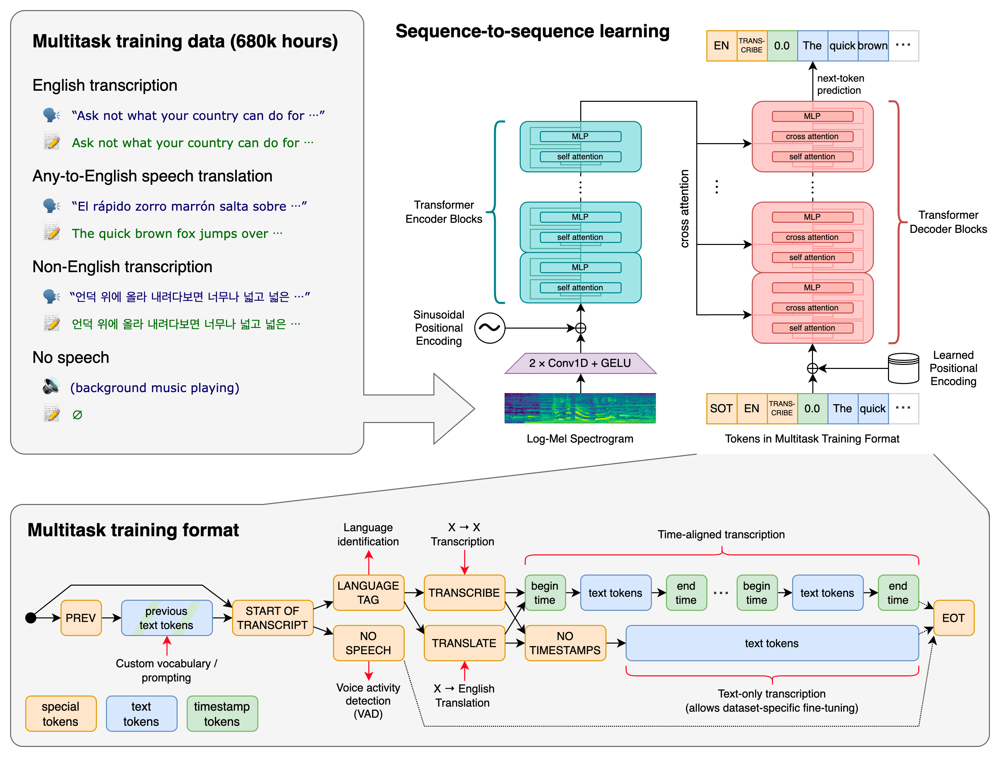
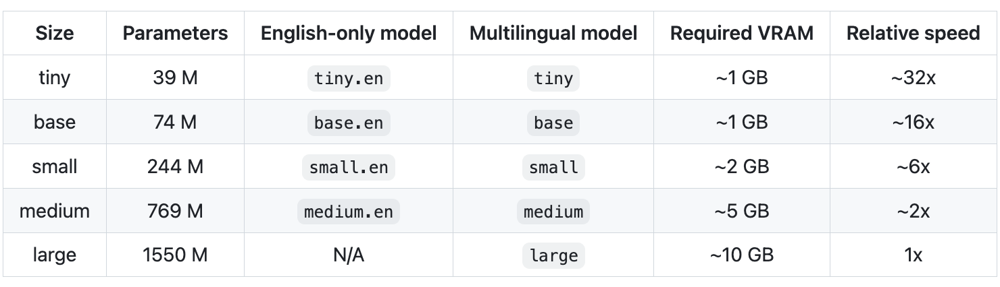

语音识别

对视频或者音频文件做语音识别，主要使用openai开源的whisper模型。

#### 环境安装
```shell
#预先装好ffmpeg的库，保证在命令行下可以通过ffmpeg执行指令
#linux环境
sudo apt update && sudo apt install ffmpeg

#如果是window 直接在官网上下载ffmpeg文件，配置到环境变量里。

pip install git+https://github.com/openai/whisper.git 
pip install pydub

```

#### 音频文件处理
- 如果输入的是视频文件，需要将视频文件提取音频，可以使用ffmpeg提取。
指令如下
```shell
# 提取视频中音频数据
ffmpeg -i 30844_1694684897.mp4 -q:a 0 -map a sample_30844.mp3
```

- 如果需要将音频剪切成不同长度的短音频，可以使用pydub来处理。
例如静音片段切割，见`split_mp3.py`
```python
chunks = split_on_silence(sound,
    # 静音片段的持续时间
    min_silence_len=30,

    # 切割片段的静音大小 -16 dBFS
    silence_thresh=-16
 )
```


- 对音频片段进行语音识别
我使用的是large-v2（可以指定下载路径download_root）
可以实现中英文混合识别结果，但可能会获取到繁体，如果需要简体可以再加一层转换，详细代码见`detect_audio.py`。

```python
import whisper

model = whisper.load_model("large-v2", download_root='openai/whisper-large-v2/')
```

```python
import whisper

model = whisper.load_model("base")
result = model.transcribe("audio.mp3")
print(result["text"])
```
openai-whisper是一个多语言的开源语音识别模型，详细见https://github.com/openai/whisper
模型基于Transformer训练，包括多语言语音识别、语音翻译、口语识别和语音活动检测。
这些任务联合表示为由解码器预测的标记序列，允许单个模型取代传统语音处理管道的许多阶段。
多任务训练格式使用一组特殊标记作为任务说明符或分类目标。


目前开源了不同大小权重的模型


目前小模型主要对英文的翻译效果比较好，large版本针对不同的语种效果不同。

主要的接口：
1.`model.transcribe("audio.mp3")`
读取完整的音频文件，并默认用30s的滑窗对每一段音频进行识别

2. `whisper.detect_language() whisper.decode()` 检测语言种类，
官方示例
```python
import whisper

model = whisper.load_model("base")

# load audio and pad/trim it to fit 30 seconds
audio = whisper.load_audio("audio.mp3")
audio = whisper.pad_or_trim(audio)

# make log-Mel spectrogram and move to the same device as the model
mel = whisper.log_mel_spectrogram(audio).to(model.device)

# detect the spoken language
_, probs = model.detect_language(mel)
print(f"Detected language: {max(probs, key=probs.get)}")

# decode the audio
options = whisper.DecodingOptions()
result = whisper.decode(model, mel, options)

# print the recognized text
print(result.text)
```


